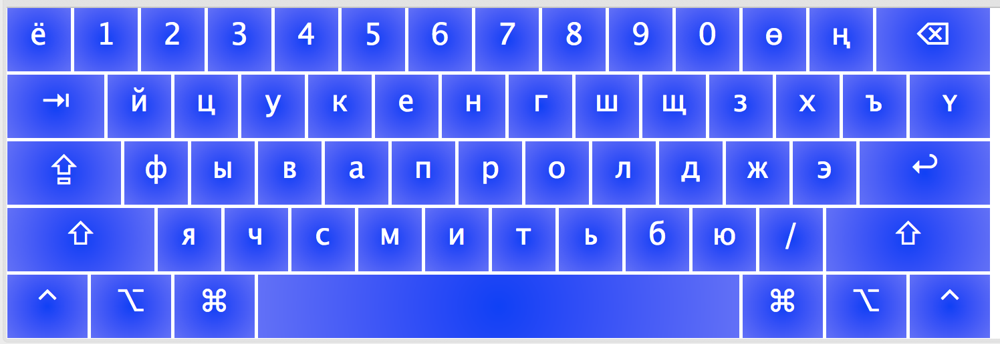
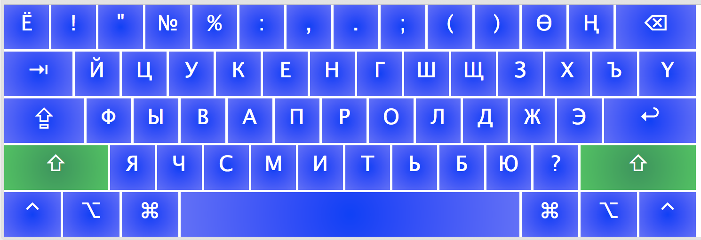
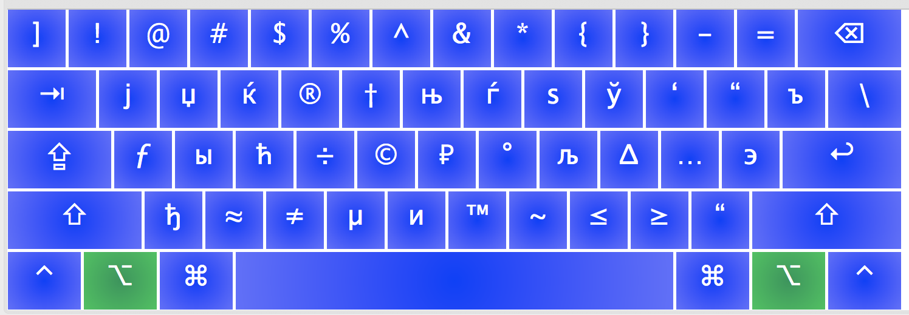
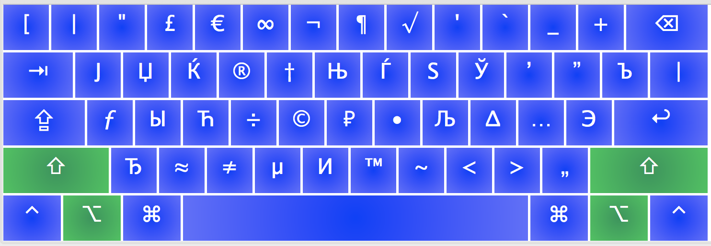

# Kyrgyz keyboard layout for macOS. Layout was inspired by Ubuntu's one.

Kyrgyz keyboard layout comes by default with Ubuntu-based systems. However it is not available by default for macOS. Here is a keyboard layout for you to install and be able to use 3 Kyrgyz-language specific (ү, ө, ң) characters. The rest of the keyboard is same as the Russian one (except `ё` is now on `~` key (left from 1)).

### How to install
1. Download [kyrgyz-layout-for-mac-ubuntu-inspired-master.zip](https://github.com/jumasheff/kyrgyz-layout-for-mac-ubuntu-inspired/archive/master.zip) to your computer.
2. Unpack the zip file. 
3. Navigate to newly created `kyrgyz-layout-for-mac-ubuntu-inspired-master` folder and copy KyrgyzLayout.bundle to **~/Library/Keyboard Layouts/**. In order to do this, go to `Finder`, hit `Shift + Command + g` simultaneously (you don't have to click on + sign, though) and enter **~/Library/Keyboard Layouts/** to the given input field. You'll be brought to `Keyboard Layouts` folder, where you should paste **KyrgyzLayout.bundle**

If you are familiar with git you can run following lines to download and move files.

```sh
git clone https://github.com/jumasheff/kyrgyz-layout-for-mac-ubuntu-inspired.git
cd kyrgyz-layout-for-mac-ubuntu-inspired/
sudo cp KyrgyzLayout.bundle /Library/Keyboard\ Layouts/
```

### How to add the layout to your keyboard 

1. Open **System Preferences**
2. Click on **input Sources** tab
3. Click **+** button
4. Select **Others** and you should see **Kyrgyz**
5. Choose it then click **Add**

### How to use
 - To type `ө` hit `minus` key and to type `Ө` hit Shift + `minus`.
 - To type `ү` hit `pipe/backslash` key and to type `Ү` hit Shift + `pipe/backslash`
 - To type `ң` hit `plus` key and to type `Ң` hit Shift `plus` 


See layout mapping screenshots:
1. Default state
2. Shift key pressed
3. Option key pressed
4. Option and Shift keys pressed

### Credits
 - Thanks to latysh for the flag icon and the README -- I copy-pasted some of his text chunks :)
You may also like his version of the layout [Kyrgyz keyboard layout for MAC users. MAC колдонуучуларга кыргызча клавиатура.](https://github.com/latysh/kyrgyz-keyboard-layout-mac)
 - This layout was built with [Ukelele Mac OS X Keyboard Layout Editor](https://scripts.sil.org/cms/scripts/page.php?site_id=nrsi&id=ukelele)
---

### Feedbacks
Please, feel free to file a bug or provide any feedback by creating an [issue](https://github.com/jumasheff/kyrgyz-layout-for-mac-ubuntu-inspired/issues) on Github page of the project.
